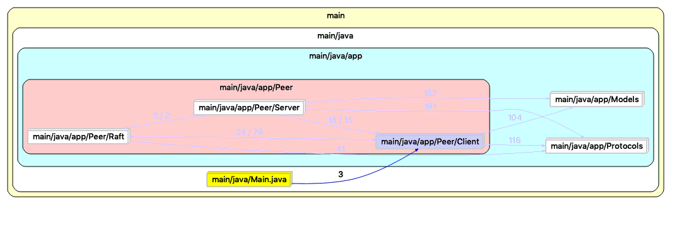
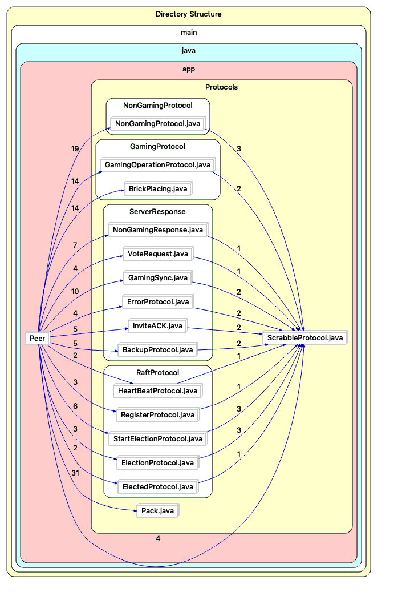

# System Architecture: 
The model-view-controller is used in the project.The model class includes the dynamic data structure used for managing data, logic and rules of the game. 
The “GameState” class represents the game state at each turn which includes information such as whose turn it is, game host address, game board information, etc. The “PeerHosts” class is used to record all the peer information in the system. The “player” class includes all the player status in the game such as turn sequence and username. The “Team” class represents information about team host and team members. The “Users” class consists of user id and user name. 
The GUI classes are the view, responsible for displaying messages to players and listening button actions. In addition, both client and server controller are constructed between model and view to process the input from one of these two components and send the output to the other.
The system is based on a peer-to-peer network, each peer contains a client and a server class. The client part of each peer connects with the server part of other peers. A leader server sends log to all other peer servers every 15 seconds.

# Scrabble Game rule:
The game is played on a 20 by 20 grid board. 
Each grid on the board can be replaced by a letter tile in each player turn. 
When tiles that touch each other make a word, the player who placed the associated letter can start a voting process where all other players can judge whether it is a proper word. 
If more than half of the players agree that it is a proper word, the player who start the voting process will get a point for each of the letter tile in the word. 
The game ends when all players choose to pass their turns without placing letter tiles. 
Words can be only read from left to right or top to bottom. 

# Communication Protocols:
The message exchange protocols fall into four categories, and all of them extend the same super class called "ScrabbleProtocol". The overview of the protocol package structure is shown as below:

# Application usage:
A person can choose to be a leader server in the login window. By entering a valid port number and username, the player can log into the lobby window. Other players can login by entering the correct ip address and port number of the leader server. Another way for other plays to login is to enter the encrypted invitation code in the “other login” panel. After successfully logging into the lobby window, the player can see other online players. Players can invite any other player in the lobby to start a game. Players who receive an invitation can choose to accept or reject the invitation. Upon acceptance of the invitation, the player will be added to the inviter’s team and be listed with other players of the team in “Current Team Members” field. When the team has more than one player, the inviter can start the game. 
The player can also shutdown its server through the “shutdown” button in server window or closing the login lobby window. 

# Raft Implementation:
The raft algorithm is implemented through the “raft” class within “peer” class to allow each peer follow the procedure of achieving consensus.
If a player’s node dies during the game, all other players can continue the game as long as there are more than one players left in the game. 
